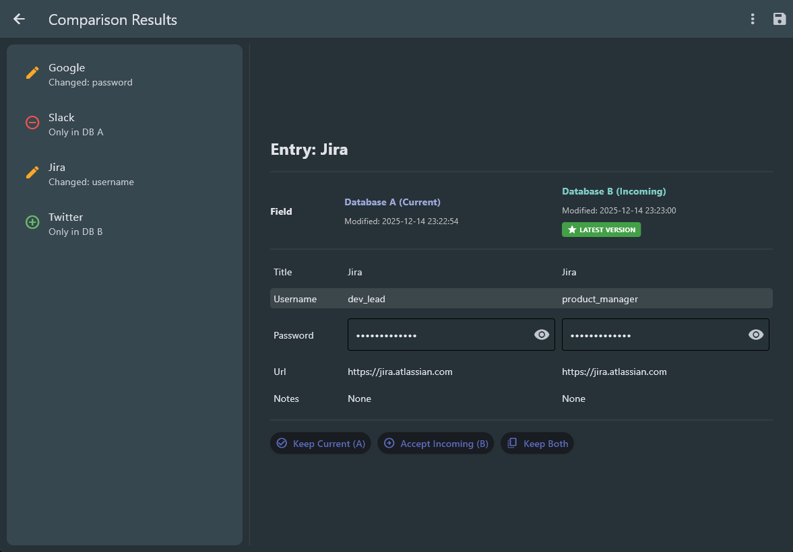

# KeePassDiff 2 - 🚧 Inviting Testers (Open Beta)

**Diff & Merge Tool for KeePass Databases**

KeePassDiff 2 is a modern desktop application for comparing and merging two KeePass (`.kdbx`) databases.

It is the successor to the original **KeePassDiff** web-based tool. While the original focused on quick comparisons, KeePassDiff 2 is designed for long-term, real-world use (especially when KeePass databases have drifted out of sync over time). The goal is to provide an **intuitive, git-like diff and merge experience**.



## 🚧 Inviting Testers (Open Beta)
🚧 
KeePassDiff 2 is currently in **early testing**, and I’m inviting users to try it out and share feedback.

If you:

- Maintain multiple KeePass databases
- Sync databases across devices or systems
- Have dealt with merge conflicts or missing entries

…your feedback would be extremely valuable.

### What I’m looking for

- Bug reports
- UX feedback
- Edge cases (large databases, long-out-of-sync histories)
- Suggestions for diff and merge behavior / more advanced features

### How to help

- Test using **non-critical or backed-up databases**
- Report issues via GitHub Issues / X
- Include steps to reproduce, logs, or screenshots if possible

> [!Important]
> We don't write to original databases. But still, since we are in beta, keep backups before testing.

## Installation

1. Install Latest Python 3.12+
2. Install dependencies:
   ```bash
   pip install -r requirements.txt
   ```
3. Run the application:

```bash
python main.py
```

## Through PyPi (experimental)

As of `0.2.2`, we have started with PyPi releases, but app may not be stable:

```
pip install keepassdiff2
```

## Usage

1. Select Database A

   _Your primary database (changes will be applied here)._

2. Select Database B

   _The database you want to compare and merge from._

3. Unlock both databases.

4. Review differences using the comparison interface.

5. Choose which changes to merge.

6. Click Save to write updates

